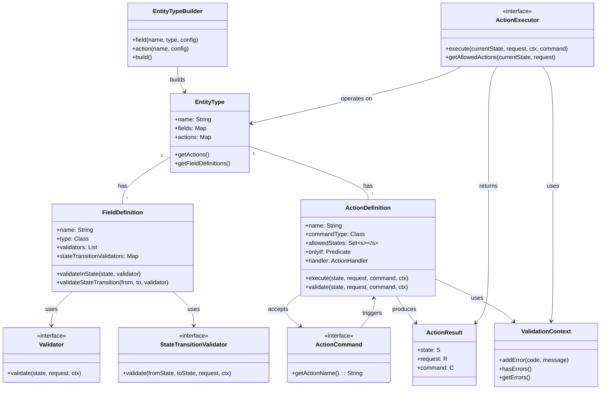

# LibEntity

LibEntity is a powerful (and fun!) Java library for building type-safe, state-driven business entities with validation and action handling. It provides a clean, expressive DSL for defining entities, their states, fields, and actions. It's like Spring Boot for your business rules, but with more good vibes and less boilerplate!

**[Check the live documentation for more details](https://paulosuzart.github.io/lib-entity-doc/)**

## lib-entity vs Traditional Hexagonal Architecture

| Feature/Aspect           | lib-entity                                                                 | Traditional Hexagonal Architecture (Hand-Made)        |
|-------------------------|-----------------------------------------------------------------------------|-------------------------------------------------------|
| **Boilerplate**         | Minimal: most patterns, wiring, and validation are handled by the framework | High: manual wiring, repetitive code, lots of classes |
| **Business Logic Focus**| DSL lets you focus on rules, states, and actions, not on plumbing           | Business logic often mixed with infrastructure code   |
| **Extensibility**       | Easily add actions, validations, fields, or states declaratively            | Requires manual changes across multiple layers        |
| **Validation & Actions**| Built-in, composable, and reusable via DSL                                  | Custom, often duplicated, and scattered               |
| **Testability**         | Entities and actions are isolated, easy to mock and test                    | Test setup is verbose, mocking can be complex         |
| **Consistency**         | Enforced by the framework and DSL, less room for error                      | Depends on developer discipline                      |
| **Learning Curve**      | Beginner-friendly, especially for new team members                          | Steep: must learn patterns, best practices, wiring    |
| **DSL/Declarative**     | Fluent, type-safe, and self-documenting                                     | Imperative, verbose, and error-prone                 |
| **Integration**         | Out-of-the-box integration with Spring, validation, and more                | Must integrate and maintain dependencies manually     |
| **Maintainability**     | High: changes in one place, less code rot                                   | Medium/Low: changes ripple through many files         |

> **Summary:**
> `lib-entity` lets you build robust, maintainable, and testable domain logic with far less code and cognitive overhead. You get all the benefits of Hexagonal Architecture, but with a declarative, beginner-friendly approach and much less boilerplate. Perfect for teams who value both flexibility and productivity.

## Features

- 🔒 Type-safe DSL for entity definition
- 🔄 State machine transitions
- ✅ Built-in validation (with easy error handling)
- 🎯 Action-based command pattern
- 📝 Rich field type support
- 🔍 Dynamic filtering
- 📚 OpenAPI generation

## Installation

Add the following to your `build.gradle`:

```groovy
dependencies {
    implementation 'com.libentity:lib-entity:1.0.0'
}
```

## Quick Start

```java
// Define your entity type
EntityType<PaymentStatus, PaymentRequestContext> paymentType = PaymentExample.PAYMENT;

// Create an executor (synchronous implementation)
ActionExecutor<PaymentStatus, PaymentRequestContext> executor = SyncActionExecutor.<PaymentStatus, PaymentRequestContext>builder()
        .entityType(paymentType)
        .build();

// Execute an action
PaymentCommand command = new PaymentCommand();
ValidationContext ctx = new ValidationContext();
ActionResult<PaymentStatus, PaymentRequestContext, PaymentCommand> result = 
    executor.execute(PaymentStatus.PENDING, new PaymentRequestContext(), ctx, command);
```

## Concepts



### Core Pieces

| Component                    | Description                                                                         |
|-----------------------------|-------------------------------------------------------------------------------------|
| **ActionExecutor**          | Interface for executing actions based on incoming commands and the current state of the entity. |
| **EntityType**             | Core configuration of an entity, containing fields, actions, and their definitions. |
| **EntityTypeBuilder**      | DSL builder for fluently configuring entities with fields, actions, and validations. |
| **FieldDefinition**        | Defines a field's type, validators, and state transition rules. |
| **ActionDefinition**       | Defines an action's command type, allowed states, conditions (onlyIf), and handler. |
| **ActionCommand**          | Interface for commands that trigger actions on entities. |
| **ActionResult**           | Result of an action execution containing new state, modified request, and command. |
| **ValidationContext**      | Collects validation errors during action execution and field validation. |
| **Validator**              | Interface for field validators that run in specific states. |
| **StateTransitionValidator** | Interface for validators that run during state transitions. |

## Usage

First, instantiate the `ActionExecutor` (using its synchronous implementation) and provide it with the necessary dependencies, such as the entity definition and other components.

```java
// Assuming you have a defined Entity like INVOICE and a suitable ActionExecutor
EntityType<InvoiceState, InvoiceRequestContext> INVOICE = // ... entity definition
ActionExecutor<InvoiceState, InvoiceRequestContext> executor = SyncActionExecutor.<InvoiceState, InvoiceRequestContext>builder()
        .entityType(INVOICE)
        .build();
```

### Execute an Action

```java
// Create the command (with any data specific to the action)
SubmitCommand submitCommand = new SubmitCommand(submitterId);

// Create a builder for the action result
SubmitResultBuilder builder = new SubmitResultBuilder();

// Execute the action
executor.execute(
    InvoiceState.DRAFT,    // Current state of the entity
    appRequest,            // The request context, includes external metadata
    validationContext,     // The validation context
    submitCommand,         // The command carrying the action-specific data
    builder                // The result builder that will hold the final response
);

// Extract the final response
SubmitResponse response = builder.getResponse();
```

## Project Modules

### `library`
The core module of the project. It provides the essential abstractions for entity types, filters, actions, and validation. This is where you will find the foundation for building flexible, metadata-driven business logic. All other modules depend on this one.

### `jooq-support`
A utility module that provides generic support for integrating the core filter abstractions with jOOQ. It allows you to automatically translate filter objects into jOOQ `Condition`s, reducing boilerplate in repository layers. Use this module if you want to leverage the power of jOOQ with minimal effort.

### `examples/spring-example`
A full-featured Spring Boot example application demonstrating how to use the core library and jooq-support modules in a real-world scenario. It includes sample entities, repositories, business rules, and integration tests. Start here if you want to see how everything fits together in practice.

### `docs`
Contains project documentation, guides, and reference materials. Check this folder for detailed explanations, API usage, and advanced topics. Great for both beginners and advanced users looking to extend or contribute to the project.

---

Each module is designed to be as independent and reusable as possible, so you can pick and choose the parts that best fit your needs. For more details, see the documentation in the `docs` folder or explore the example project!

## Integration with Spring Boot

Check out our [Spring Boot example](examples/spring-example) for a complete demonstration of:

- REST API integration
- Database persistence with jOOQ
- OpenAPI documentation
- Testing with Testcontainers

## Contributing

We welcome contributions! Please see our [Contributing Guide](CONTRIBUTING.md) for details.

## License

This project is licensed under the MIT License - see the [LICENSE](LICENSE) file for details.

---

Made with ☕, 💡 and lots of Java love.
